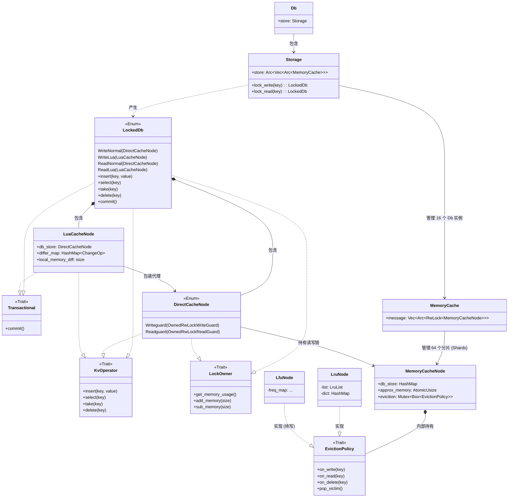

# 数据引擎架构图 (Eviction Module)

经过模块化拆分和“零成本抽象”重构后，目前底层数据引擎的架构如下：

## 架构分层说明

1. **入口层 (Entry Layer)**: `Db` -> `Storage` -> `MemoryCache`。负责定位 DB 索引和 Shard (分片) 索引，返回持有锁的保护器。
2. **零成本路由层 (Routing Layer)**: `LockedDb` (在 `src/db/mod.rs` 中)。它作为整个引擎的唯一对外操作句柄，通过静态 `match` 匹配，将外界对 `insert/select` 的调用，零开销地转发给底层的节点。
3. **接口契约层 (Trait Layer)**: `src/db/eviction/traits.rs`。定义了引擎的能力边界：`KvOperator` (读写)，`Transactional` (事务提交)，`LockOwner` (内存记账)。这些纯粹是行为约束，不再带有任何异步 (`async`) 负担。
4. **操作节点层 (Operator Layer)**:
   - `DirectCacheNode` (`src/db/eviction/direct_node.rs`): 最纯粹的直接操作器，持有真正的 `RwLockGuard`，它的读写会直接改变内存。
   - `LuaCacheNode` (`src/db/eviction/lua_node.rs`): 事务操作器，内部维护了一个 `differ_map` (悔棋小本子)，拦截所有的改动，直到 `commit` 被调用才会写回 `DirectCacheNode`。
5. **物理存储层 (Physical Layer)**: `MemoryCacheNode` (`src/db/eviction/cache_store.rs`)。它是真正的仓库，包含一个 `HashMap` (存数据)，一个 `AtomicUsize` (存自己分片的账本)，以及一把互斥锁保护的 `EvictionPolicy` (淘汰策略小弟)。
